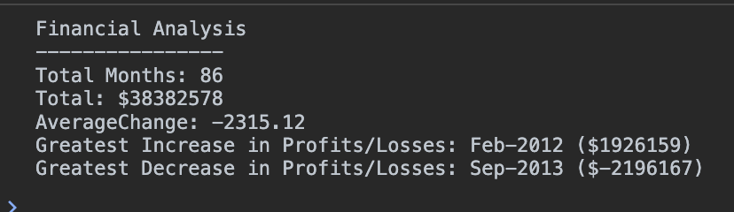

**Description**

This is a challenge to output financial information from a selection of data using JavaScript.

Data was provided in the format 

    var finances = [
        ['Jan-2010', 867884],
        ['Feb-2010', 984655],
        ['Mar-2010', 322013],
        ['Apr-2010', -69417]
        ... ]

The challenge was to identify the following information and report it in the console - 

- The total number of months included in the dataset
- The net total amount of Profit/Losses over the entire period
- The average of the changes in Profit/Losses over the entire period
- The greatest increase in Profit/Losses (date and amount) over the entire period
- The greatest decrease in Profit/Losses (date and amount) over the entire period

**Results**

The expected results were -  

    Financial Analysis 
    ----------------
    Total Months: 86
    Total: $38382578
    Average Change: -2315.12
    Greatest Increase in Profits/Losses: Feb-2012 ($1926159)
    Greatest Decrease in Profits/Losses: Sep-2013 ($-2196167)

I used a combination of variables, 'for loops' and 'if statements' in order to complete this challenge.  

My results can be viewed by opening index.html in Google Chrome and using Developer Tools to inspect the console - 

;

